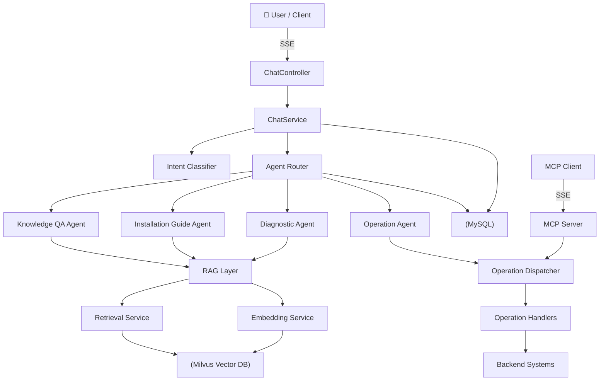

<p align="center">
  
  
  
  
  
  
</p>

<h1 align="center">🤖 AI Install Assistant</h1>

<p align="center">
  <strong>An enterprise-grade multi-agent AI platform for software installation, deployment, and operations.</strong>
</p>

<p align="center">
  <a href="README.zh-CN.md">
    
  </a>
</p>

<p align="center">
  <a href="#-features">Features</a> ·
  <a href="#-architecture">Architecture</a> ·
  <a href="#-quick-start">Quick Start</a> ·
  <a href="#-api-reference">API</a> ·
  <a href="#-project-structure">Structure</a> ·
  <a href="#-deployment">Deployment</a> ·
  <a href="#-license">License</a>
</p>

---

## ✨ Features

| Capability | Description |
|---|---|
| 📚 **Knowledge Q&A** | RAG-powered question answering over installation manuals, configuration guides, and product docs — with automatic fallback to built-in knowledge when Milvus is unavailable |
| 📖 **Installation Guide** | Step-by-step walkthrough of product installation, from prerequisites to verification |
| ⚙️ **Automated Operations** | Create clusters, provision partitions, add service instances, start/stop/restart microservices — dispatched through LLM intent recognition |
| 🔧 **Troubleshooting** | Symptom analysis, root-cause reasoning, and actionable remediation steps |
| 🔗 **MCP Server** | Exposes operations as MCP tools over SSE, enabling external AI clients (Claude Desktop, Cursor, etc.) to control your infrastructure |
| 🗂️ **Knowledge Management** | Upload text or Markdown files, persisted to MySQL + optionally indexed in Milvus |
| 💬 **Streaming Chat** | Server-Sent Events (SSE) streaming responses with session management and conversation history |

### 🤖 Multi-Agent System

The platform routes each user request through **8 intent types** to **4 specialized micro-agents**:

```
KnowledgeQAAgent       → RAG retrieval + LLM generation
InstallationGuideAgent → step-by-step installation walkthrough
OperationAgent         → parse & execute operational commands
DiagnosticAgent        → fault analysis & resolution advice
```

### 🧠 Intent Recognition

Leverages an LLM few-shot prompt (`prompts/intent-classifier.st`) to classify user input into one of 8 intent categories with parameter extraction — all in a single LLM call. Falls back gracefully to chitchat mode.

---

## 🏗 Architecture



---

## 🧰 Tech Stack

| Component | Version | Purpose |
|---|---|---|
| **JDK** | 17 | Runtime |
| **Spring Boot** | 3.5.1 | Application framework |
| **Spring AI** | 1.1.7 | AI abstraction layer (Embedding, VectorStore, MCP) |
| **LangChain4j** | 1.15.1 | Agent orchestration, Tool Router, LLM integration |
| **Milvus** | 2.4 | Vector database for RAG |
| **MySQL** | 8.0 | Session logs, conversation history, document metadata |
| **H2** | embedded | Dev/test mode — zero-dependency database |
| **MCP** | 0.8+ | Model Context Protocol (SSE transport) |
| **DeepSeek** | deepseek-chat | LLM via OpenAI-compatible API |
| **Docker** | 20.10+ | Infrastructure (Milvus + MySQL containers) |
| **Gradle** | 8.12 | Build tool (wrapper included) |

---

## 🚀 Quick Start

### Prerequisites

- **JDK 17+**
- **Docker & Docker Compose v2** (for Milvus + MySQL)
- **Git**

### 1. Clone & Configure

```bash
git clone https://github.com/Dasooul03/ai-install-assistant.git
cd ai-install-assistant

# Copy the env template
cp .env.example .env

# Edit .env — at minimum, set your LLM_API_KEY
# Supports any OpenAI-compatible provider (DeepSeek, OpenAI, etc.)
```

### 2. Start Infrastructure

```bash
docker compose up -d
# Wait for Milvus (:19530) and MySQL (:3306) to be ready
```

### 3. Run the Application

```bash
# Development mode (MySQL + DevTools hot-reload)
./gradlew bootRun

# or Production mode (H2 file DB, no DevTools)
./gradlew bootRun --args='--spring.profiles.active=prod'
```

Visit **http://localhost:8080** to open the chat UI.

### 4. Upload Knowledge (optional)

```bash
# Upload text content
curl -X POST http://localhost:8080/api/knowledge/upload/text \
  -H "Content-Type: application/json" \
  -d '{"content":"## Installation Prep\nRequires JDK 17+","fileName":"setup.md","docType":"MANUAL"}'

# Upload a file
curl -X POST http://localhost:8080/api/knowledge/upload/file \
  -F "file=@knowledge-base.md" \
  -F "docType=MANUAL"
```

### 5. Test the Chat

```bash
# Synchronous
curl -X POST http://localhost:8080/api/chat/sync \
  -H "Content-Type: application/json" \
  -d '{"message":"How do I install this?","sessionId":null}'

# SSE streaming
curl -X POST http://localhost:8080/api/chat \
  -H "Content-Type: application/json" \
  -d '{"message":"Create a 3-node cluster"}'
```

---

## 🔌 API Reference

Base URL: `http://localhost:8080`

### Chat

| Method | Path | Description |
|---|---|---|
| `POST` | `/api/chat` | SSE streaming chat |
| `POST` | `/api/chat/sync` | Synchronous chat (returns JSON) |
| `GET` | `/api/sessions` | List active sessions |
| `POST` | `/api/sessions` | Create a new session |
| `GET` | `/api/sessions/{id}/history` | Get session conversation history |

### Knowledge Base

| Method | Path | Description |
|---|---|---|
| `POST` | `/api/knowledge/upload/text` | Upload text content (JSON body) |
| `POST` | `/api/knowledge/upload/file` | Upload file (multipart, `.md` / `.txt`) |
| `DELETE` | `/api/knowledge/{id}` | Delete a document |
| `GET` | `/api/knowledge/list` | List all documents |

### MCP

| Method | Path | Description |
|---|---|---|
| `GET` / `POST` | `/mcp/sse` | MCP Server SSE endpoint — exposes `createCluster`, `createPartition`, `addInstance`, `manageService` tools |

### Health

| Method | Path | Description |
|---|---|---|
| `GET` | `/actuator/health` | Health check |
| `GET` | `/api` | API index (lists all endpoints) |

---

## 📂 Project Structure

```
src/main/java/com/example/installassistant/
├── agent/               # Multi-agent system (Router + 4 micro-agents)
│   ├── AgentRouter.java
│   ├── KnowledgeQAAgent.java
│   ├── InstallationGuideAgent.java
│   ├── OperationAgent.java
│   └── DiagnosticAgent.java
├── config/              # Spring configuration (AI / Milvus / MCP)
│   ├── AiConfig.java
│   ├── MilvusConfig.java
│   └── McpConfig.java
├── controller/          # REST controllers
│   ├── ChatController.java
│   ├── IndexController.java
│   └── KnowledgeController.java
├── intent/              # Intent recognition (8 types)
│   ├── IntentType.java
│   ├── IntentResult.java
│   └── IntentClassifier.java
├── model/               # JPA entities
│   ├── Session.java
│   ├── ConversationMessage.java
│   ├── OperationLog.java
│   └── KnowledgeDocument.java
├── operation/           # Operation dispatcher + handlers
│   ├── OperationHandler.java
│   ├── OperationDispatcher.java
│   ├── CreateClusterHandler.java
│   ├── CreatePartitionHandler.java
│   ├── AddInstanceHandler.java
│   └── ServiceLifecycleHandler.java
├── rag/                 # RAG system (Load / Embed / Retrieve)
│   ├── DocumentLoader.java
│   ├── EmbeddingService.java
│   ├── RetrievalService.java
│   ├── PromptBuilder.java
│   └── KnowledgeService.java
├── repository/          # Spring Data JPA repositories
├── service/             # Business services
│   ├── ChatService.java
│   ├── SessionService.java
│   └── ConversationHistoryService.java
└── AiInstallAssistantApplication.java
```

---

## ⚙️ Configuration

All settings are driven by environment variables. Copy `.env.example` to `.env` and fill in your values.

| Variable | Default | Description |
|---|---|---|
| `LLM_API_KEY` | *(required)* | API key for the LLM (OpenAI-compatible) |
| `LLM_BASE_URL` | `https://api.deepseek.com/v1` | LLM API base URL |
| `LLM_MODEL_NAME` | `deepseek-chat` | Model name |
| `SERVER_PORT` | `8080` | Application port |
| `LOG_LEVEL` | `INFO` | Root log level |
| `MYSQL_HOST` | `localhost` | MySQL host |
| `MYSQL_PORT` | `3306` | MySQL port |
| `MYSQL_DATABASE` | `install_assistant` | MySQL database name |
| `MYSQL_USERNAME` | `root` | MySQL username |
| `MYSQL_PASSWORD` | `root123` | MySQL password |
| `MILVUS_HOST` | `localhost` | Milvus host |
| `MILVUS_PORT` | `19530` | Milvus port |

### Profiles

| Profile | Database | DevTools | Logging | Use case |
|---|---|---|---|---|
| `default` (no profile) | MySQL | Enabled | DEBUG | Local development |
| `prod` | H2 file | Disabled | INFO | Production deployment |
| `h2` | H2 file | Enabled | DEBUG | Quick local testing without Docker |

---

## 🧪 Testing

```bash
# Run all tests
./gradlew test

# Run a specific test class
./gradlew test --tests "com.example.installassistant.intent.IntentClassifierTest"

# Build without tests
./gradlew build -x test
```

---

## 🐳 Deployment

### As a Standalone JAR

```bash
# Build the fat JAR
./gradlew bootJar

# Run with production profile
java -jar -Xmx512m build/libs/ai-install-assistant-0.1.0-SNAPSHOT.jar \
  --spring.profiles.active=prod
```

### Via Docker (multi-stage build)

```bash
# Build the image
docker build -t ai-install-assistant .

# Run
docker run -p 8080:8080 --env-file .env ai-install-assistant
```

A pre-built base knowledge document (`base-knowledge.md`) is embedded in the JAR — the application works out-of-the-box even without Milvus or a MySQL connection.

> ⚠️ **Security note**: The `.env` file is excluded from Git via `.gitignore`. Never hardcode API keys in `application.yml`.

---

## 📄 License

MIT © 2025 Dasooul03

---

<p align="center">
  <sub>Made with ☕ and 🤖</sub>
</p>
