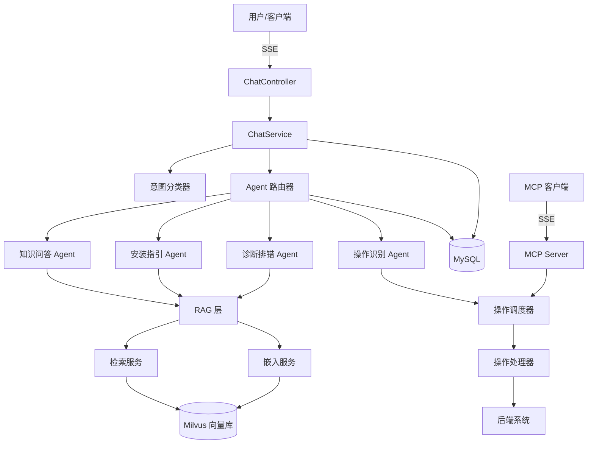

# 智能体平台-智能安装助手

> 基于 Spring Boot + Spring AI + LangChain4j + MCP + RAG + LLM + Milvus + MySQL  
> 具备持续学习与自适应能力的 AI 智能体平台

## 架构概览



## 技术栈

| 组件 | 版本 | 用途 |
|---|---|---|
| JDK | 17 | 运行环境 |
| Spring Boot | 3.5.x | 应用框架 |
| Spring AI | 1.1.x | AI 抽象层 (Embedding, VectorStore, MCP) |
| LangChain4j | 1.15.x | Agent 编排、Tool Router |
| Milvus | 2.4 | 向量数据库 |
| MySQL | 8.0 | 会话日志、知识文档元数据 |
| MCP | 0.8+ | Model Context Protocol SSE |
| DashScope | text-embedding-v3 | 文本向量化 |

## 快速启动

### 环境要求

- JDK 17+
- Docker & Docker Compose v2
- Git

### 1. 克隆并配置

```bash
git clone <repo-url>
cd ai-install-assistant
cp .env.example .env
# 编辑 .env 填写 API Key
```

### 2. 启动基础设施

```bash
docker compose up -d
# 等待 Milvus (19530) 和 MySQL (3306) 就绪
```

### 3. 启动应用

```bash
./gradlew bootRun
```

### 4. 导入示例知识库

```bash
# Windows (PowerShell)
# 手动调用 API:
curl -X POST http://localhost:8080/api/knowledge/upload/text \
  -H "Content-Type: application/json" \
  -d '{"content":"## 安装准备\n需要 JDK 17+","fileName":"安装手册.md","docType":"MANUAL"}'
```

### 5. 测试对话

```bash
# 同步接口
curl -X POST http://localhost:8080/api/chat/sync \
  -H "Content-Type: application/json" \
  -d '{"message":"如何安装？","sessionId":null}'

# SSE 流式接口
curl -X POST http://localhost:8080/api/chat \
  -H "Content-Type: application/json" \
  -d '{"message":"帮我创建一个3节点集群"}'
```

## API 文档

### 聊天接口

| 方法 | 路径 | 说明 |
|---|---|---|
| POST | `/api/chat` | SSE 流式对话 |
| POST | `/api/chat/sync` | 同步对话 |
| GET | `/api/sessions` | 会话列表 |
| POST | `/api/sessions` | 创建新会话 |
| GET | `/api/sessions/{id}/history` | 会话历史 |

### 知识库接口

| 方法 | 路径 | 说明 |
|---|---|---|
| POST | `/api/knowledge/upload/text` | 上传文本 |
| POST | `/api/knowledge/upload/file` | 上传文件 (multipart) |
| DELETE | `/api/knowledge/{id}` | 删除文档 |
| GET | `/api/knowledge/list` | 文档列表 |

### MCP 接口

| 方法 | 路径 | 说明 |
|---|---|---|
| GET/POST | `/mcp/sse` | MCP SSE endpoint |

## 项目结构

```
src/main/java/com/example/installassistant/
├── agent/          # 多智能体 (Router + 4个微Agent)
├── config/         # Spring 配置 (AI/Milvus/MCP)
├── controller/     # REST 控制器
├── intent/         # 意图识别 (8 种意图)
├── model/          # JPA Entity (4 个)
├── operation/      # 操作调度 (4 个Handler)
├── rag/            # RAG 系统 (Loader/Embed/Retrieve)
├── repository/     # Spring Data JPA
└── service/        # 业务服务
```

## 测试

```bash
# 运行所有测试
./gradlew test

# 跳过集成测试（不需要 Docker）
./gradlew test -x integrationTest
```

## 环境变量

| 变量 | 默认值 | 说明 |
|---|---|---|
| LLM_API_KEY | - | LLM API Key (OpenAI 兼容) |
| LLM_BASE_URL | https://api.openai.com/v1 | LLM 接口地址 |
| LLM_MODEL_NAME | gpt-4o-mini | 聊天模型名称 |
| DASHSCOPE_API_KEY | - | 阿里 DashScope Key |
| MILVUS_HOST | localhost | Milvus 地址 |
| MYSQL_PASSWORD | root123 | MySQL 密码 |

## License

MIT
