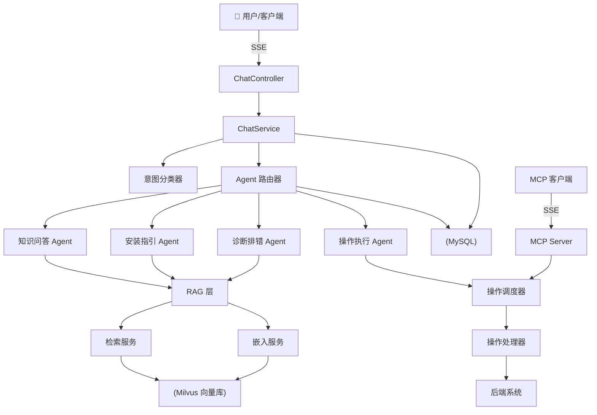

<p align="center">
  
  
  
  
  
  
</p>

<h1 align="center">🤖 智能安装助手</h1>

<p align="center">
  <strong>面向企业级产品安装部署场景的 AI 多智能体平台</strong>
</p>

<p align="center">
  <a href="README.md">
    
  </a>
</p>

<p align="center">
  <a href="#-核心能力">核心能力</a> ·
  <a href="#-系统架构">系统架构</a> ·
  <a href="#-快速启动">快速启动</a> ·
  <a href="#-接口文档">接口文档</a> ·
  <a href="#-项目结构">项目结构</a> ·
  <a href="#-部署">部署</a> ·
  <a href="#-许可证">许可证</a>
</p>

---

## ✨ 核心能力

| 能力 | 说明 |
|---|---|
| 📚 **知识问答** | RAG 检索增强生成，基于安装手册/配置指南/产品文档回答用户问题；Milvus 不可用时自动回退到内置知识库 |
| 📖 **安装指引** | 分步骤引导完成产品安装部署流程，从环境准备到最终验证 |
| ⚙️ **自动化操作** | 创建集群、划分分区、扩缩实例、微服务启停 — 全通过 LLM 意图识别驱动 |
| 🔧 **故障诊断** | 症状分析、根因推断，提供可操作的排查步骤和解决方案 |
| 🔗 **MCP Server** | 通过 SSE 将运维操作暴露为 MCP 工具，外部 AI 客户端（Claude Desktop、Cursor 等）可直接调用 |
| 🗂️ **知识库管理** | 上传文本/Markdown 文件，持久化到 MySQL 并可选索引到 Milvus 向量库 |
| 💬 **流式对话** | SSE 流式输出，支持会话管理和完整对话历史 |

### 🤖 多智能体系统

平台将每个用户请求通过 **8 种意图类型** 路由到 **4 个专业微智能体**：

```
KnowledgeQAAgent       → RAG 检索 + LLM 生成
InstallationGuideAgent → 分步安装指引
OperationAgent         → 解析并执行运维操作
DiagnosticAgent        → 故障分析与修复建议
```

### 🧠 意图识别

基于 LLM few-shot prompt（`prompts/intent-classifier.st`），单次 LLM 调用完成 8 类意图识别和参数提取，识别失败时自动回退到闲聊模式。

---

## 🏗 系统架构



---

## 🧰 技术栈

| 组件 | 版本 | 用途 |
|---|---|---|
| **JDK** | 17 | 运行环境 |
| **Spring Boot** | 3.5.1 | 应用框架 |
| **Spring AI** | 1.1.7 | AI 抽象层（Embedding、VectorStore、MCP） |
| **LangChain4j** | 1.15.1 | Agent 编排、Tool Router、LLM 集成 |
| **Milvus** | 2.4 | 向量数据库（RAG 检索） |
| **MySQL** | 8.0 | 会话日志、对话历史、文档元数据 |
| **H2** | 内嵌 | 开发/测试用零依赖数据库 |
| **MCP** | 0.8+ | Model Context Protocol（SSE 传输） |
| **DeepSeek** | deepseek-chat | LLM 模型（兼容 OpenAI 协议） |
| **Docker** | 20.10+ | 基础设施容器化（Milvus + MySQL） |
| **Gradle** | 8.12 | 构建工具（含 wrapper） |

---

## 🚀 快速启动

### 环境要求

- **JDK 17+**
- **Docker & Docker Compose v2**（用于启动 Milvus + MySQL）
- **Git**

### 1. 克隆并配置

```bash
git clone https://github.com/Dasooul03/ai-install-assistant.git
cd ai-install-assistant

# 复制环境变量模板
cp .env.example .env

# 编辑 .env，至少填写 LLM_API_KEY
# 支持任意 OpenAI 兼容协议模型（DeepSeek、OpenAI 等）
```

### 2. 启动基础设施

```bash
docker compose up -d
# 等待 Milvus（:19530）和 MySQL（:3306）就绪
```

### 3. 启动应用

```bash
# 开发模式（MySQL + DevTools 热重载）
./gradlew bootRun

# 或生产模式（H2 文件数据库，关闭 DevTools）
./gradlew bootRun --args='--spring.profiles.active=prod'
```

浏览器访问 **http://localhost:8080** 打开对话界面。

### 4. 上传知识库（可选）

```bash
# 上传文本内容
curl -X POST http://localhost:8080/api/knowledge/upload/text \
  -H "Content-Type: application/json" \
  -d '{"content":"## 安装准备\n需要 JDK 17+","fileName":"安装手册.md","docType":"MANUAL"}'

# 上传文件
curl -X POST http://localhost:8080/api/knowledge/upload/file \
  -F "file=@knowledge-base.md" \
  -F "docType=MANUAL"
```

### 5. 测试对话

```bash
# 同步接口
curl -X POST http://localhost:8080/api/chat/sync \
  -H "Content-Type: application/json" \
  -d '{"message":"如何安装？","sessionId":null}'

# SSE 流式接口
curl -X POST http://localhost:8080/api/chat \
  -H "Content-Type: application/json" \
  -d '{"message":"帮我创建一个3节点集群"}'
```

---

## 🔌 接口文档

基础地址：`http://localhost:8080`

### 聊天

| 方法 | 路径 | 说明 |
|---|---|---|
| `POST` | `/api/chat` | SSE 流式对话 |
| `POST` | `/api/chat/sync` | 同步对话（返回 JSON） |
| `GET` | `/api/sessions` | 会话列表 |
| `POST` | `/api/sessions` | 创建新会话 |
| `GET` | `/api/sessions/{id}/history` | 获取会话历史 |

### 知识库

| 方法 | 路径 | 说明 |
|---|---|---|
| `POST` | `/api/knowledge/upload/text` | 上传文本内容（JSON 格式） |
| `POST` | `/api/knowledge/upload/file` | 上传文件（multipart，`.md` / `.txt`） |
| `DELETE` | `/api/knowledge/{id}` | 删除文档 |
| `GET` | `/api/knowledge/list` | 文档列表 |

### MCP

| 方法 | 路径 | 说明 |
|---|---|---|
| `GET` / `POST` | `/mcp/sse` | MCP Server SSE 端点 — 暴露 `createCluster`、`createPartition`、`addInstance`、`manageService` 四个工具 |

### 健康检查

| 方法 | 路径 | 说明 |
|---|---|---|
| `GET` | `/actuator/health` | 健康检查 |
| `GET` | `/api` | API 索引（列出所有端点） |

---

## 📂 项目结构

```
src/main/java/com/example/installassistant/
├── agent/               # 多智能体系统（Router + 4个微Agent）
│   ├── AgentRouter.java
│   ├── KnowledgeQAAgent.java
│   ├── InstallationGuideAgent.java
│   ├── OperationAgent.java
│   └── DiagnosticAgent.java
├── config/              # Spring 配置（AI / Milvus / MCP）
│   ├── AiConfig.java
│   ├── MilvusConfig.java
│   └── McpConfig.java
├── controller/          # REST 控制器
│   ├── ChatController.java
│   ├── IndexController.java
│   └── KnowledgeController.java
├── intent/              # 意图识别（8 种意图类型）
│   ├── IntentType.java
│   ├── IntentResult.java
│   └── IntentClassifier.java
├── model/               # JPA 实体
│   ├── Session.java
│   ├── ConversationMessage.java
│   ├── OperationLog.java
│   └── KnowledgeDocument.java
├── operation/           # 操作调度器 + 处理器
│   ├── OperationHandler.java
│   ├── OperationDispatcher.java
│   ├── CreateClusterHandler.java
│   ├── CreatePartitionHandler.java
│   ├── AddInstanceHandler.java
│   └── ServiceLifecycleHandler.java
├── rag/                 # RAG 系统（加载/嵌入/检索）
│   ├── DocumentLoader.java
│   ├── EmbeddingService.java
│   ├── RetrievalService.java
│   ├── PromptBuilder.java
│   └── KnowledgeService.java
├── repository/          # Spring Data JPA 仓库接口
├── service/             # 业务服务
│   ├── ChatService.java
│   ├── SessionService.java
│   └── ConversationHistoryService.java
└── AiInstallAssistantApplication.java
```

---

## ⚙️ 配置说明

所有配置通过环境变量管理。复制 `.env.example` 为 `.env` 后填入实际值。

| 变量 | 默认值 | 说明 |
|---|---|---|
| `LLM_API_KEY` | *(必填)* | LLM API 密钥（兼容 OpenAI 协议） |
| `LLM_BASE_URL` | `https://api.deepseek.com/v1` | LLM API 地址 |
| `LLM_MODEL_NAME` | `deepseek-chat` | 模型名称 |
| `SERVER_PORT` | `8080` | 应用端口 |
| `LOG_LEVEL` | `INFO` | 根日志级别 |
| `MYSQL_HOST` | `localhost` | MySQL 主机 |
| `MYSQL_PORT` | `3306` | MySQL 端口 |
| `MYSQL_DATABASE` | `install_assistant` | MySQL 数据库名 |
| `MYSQL_USERNAME` | `root` | MySQL 用户名 |
| `MYSQL_PASSWORD` | `root123` | MySQL 密码 |
| `MILVUS_HOST` | `localhost` | Milvus 主机 |
| `MILVUS_PORT` | `19530` | Milvus 端口 |

### Profile 说明

| Profile | 数据库 | DevTools | 日志级别 | 适用场景 |
|---|---|---|---|---|
| `default`（无 profile） | MySQL | 开启 | DEBUG | 本地开发 |
| `prod` | H2 文件 | 关闭 | INFO | 生产部署 |
| `h2` | H2 文件 | 开启 | DEBUG | 无 Docker 的快速测试 |

---

## 🧪 测试

```bash
# 运行所有测试
./gradlew test

# 运行指定测试类
./gradlew test --tests "com.example.installassistant.intent.IntentClassifierTest"

# 跳过测试构建
./gradlew build -x test
```

---

## 🐳 部署

### 独立 JAR 部署

```bash
# 构建胖 JAR
./gradlew bootJar

# 生产模式运行
java -jar -Xmx512m build/libs/ai-install-assistant-0.1.0-SNAPSHOT.jar \
  --spring.profiles.active=prod
```

### Docker 部署（多阶段构建）

```bash
# 构建镜像
docker build -t ai-install-assistant .

# 运行
docker run -p 8080:8080 --env-file .env ai-install-assistant
```

内置知识文档（`base-knowledge.md`）已打包在 JAR 中 —— 即使没有 Milvus 和 MySQL 也能开箱即用。

> ⚠️ **安全提醒**：`.env` 文件已在 `.gitignore` 中排除，不会提交到 Git。切勿将 API Key 硬编码在 `application.yml` 中。

---

## 📄 许可证

MIT © 2025 Dasooul03

---

<p align="center">
  <sub>Made with ☕ and 🤖</sub>
</p>
